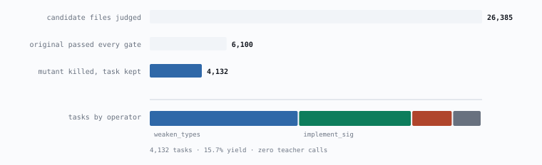
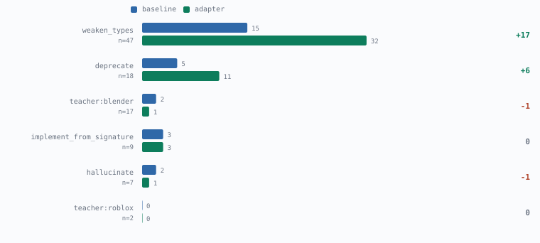

# Stop Making Things Up

*A plain-language companion to [the technical paper](PAPER.md).*

A 14B coding model kept inventing Roblox functions that don't exist. We taught it not to,
by breaking working code on purpose and letting a compiler grade the homework.

---

Ask a mid-size open coding model to write Roblox code and it will hand you something that
looks completely right. Clean structure, sensible names, confident comments. Then you run it and
it explodes, because it called a function nobody ever wrote.

We tested a 14-billion-parameter open coding model on 13 real tasks. It got **one** right.
We did not test GPT, Claude or Gemini class models, so nothing here says anything about
those. Here is what the failures actually looked like:

```
noise() takes at most 2 arguments (3 given)
create_cone: keyword "diameter1" is invalid
operator "extrude_region_mov…" does not exist
8 · 6 · 17 · 5 · 12 · 21 type errors, six more tasks

unparseable output: 0
```

None of these is a logic error. In each case the model called something that does not
exist, or passed arguments the real function does not take. It also got the output format
right every single time, so nothing short of running the code would have caught any of it.

## The idea: let the computer grade it

Most AI training data gets checked by another AI, or by nobody at all. For essays that's a
reasonable compromise, since there's no better option. For code it makes very little sense,
because you can simply run the thing and find out.

Roblox has a type checker that knows every real function in the engine. Blender can build
the 3D model and let you measure it. So instead of asking "does this look right?", we ask
questions with actual answers: does it compile? does it pass the linter? does it run? did it
build a shape with the right number of triangles and the normals facing outward?

Every training example has to survive all of that. If it doesn't, it's thrown away.

## The trick: break working code on purpose

This is the part we think is new. Training data needs a question and a correct
answer to go with it, and producing correct answers is where the cost usually sits.

So we don't write them. We find code that already works, real published open-source Roblox
libraries, and we break it.

| step | what happens |
|---|---|
| 1. Check it works | Run a real file through every check. If it fails, discard it. We only want files known to be correct. |
| 2. Break it deliberately | Rename a real function to one that sounds real but isn't. Strip the type annotations. Swap a modern call for an outdated one. |
| 3. Prove it's broken | Run the checks again. They must now fail. If the tools can't tell the difference, throw the example away, because a bug nothing can detect teaches nothing. |
| 4. The answer is free | The correct answer is the original file the human wrote. No AI needed to produce it, and it has already been verified. |

The third step comes from a software-testing technique called mutation testing, and it does
most of the work in keeping the data honest. Without it you only know you changed something.
With it you know you changed something the tools can prove is wrong.

This produced **4,132 training examples from 26,385 files**, at zero cost in AI calls.

<picture>
  <source media="(prefers-color-scheme: dark)" srcset="../figures/fig1-funnel-dark.svg">
  
</picture>

## Did it work?

| | before training | after |
|---|---:|---:|
| tasks passed (of 100) | 27 | **48** |
| probability of a split this lopsided if training changed nothing | | **p = 0.0005** |

The model fixed 28 things the untrained version couldn't, and broke 7 that previously
worked. The test tasks came from repositories the model had never seen, not just files it
hadn't seen. Getting that distinction wrong invalidated an earlier result of ours.

## But it didn't learn everything

Break the results down by task type and the gains sit in two columns, both of them the
"fix this broken Roblox file" kind. The model got no better at 3D modelling, at spotting
fake APIs, or at writing a module from scratch.

<picture>
  <source media="(prefers-color-scheme: dark)" srcset="../figures/fig3-categories-dark.svg">
  
</picture>

> The model got better at repairing broken Roblox files, which is exactly what we trained it
> on. On everything else it stayed where it started.

Those per-category numbers wobble by a few tasks between runs, so read the shape rather than
the exact figures.

## Bugs in our own measurements

We found **eleven bugs in our own measurement code**. Every one produced a believable number
instead of an error message. That's what makes this class of bug dangerous: nothing crashes,
no stack trace appears, and you carry on believing something false for weeks.

**Markdown fences.** The model wrapped its code in ``` markers. Our parser didn't strip them,
so perfectly valid Python was scored as a syntax error. Fixing it moved the score from 0% to
7.7%.

**Leaky test set.** We split training and testing by file, so files from the *same library*
ended up on both sides. The model could learn a codebase's house style and look like it was
generalising. This invalidated a result we had already celebrated.

**Our own word limit.** After training the model wrote longer explanations, and our harness
cut it off mid-sentence then marked it wrong for not finishing. Doubling the limit took
unreadable outputs from 14 down to 9. The score did not move, but nine tasks were still
being judged on a truncated answer.

**The dice.** We re-ran the *untrained* model on the *same* tasks and it scored 32 one time
and 27 the next. Nothing changed but chance. That's ±5 tasks of randomness, about the size of
some effects we'd been calling results.

## Still unresolved

Single training run, so no error bars. Scores wobble ±5 tasks run to run because we never
fixed the random seed. The test tasks are made by the same process that made the training
tasks, which is a bit like setting your own exam. Seven tasks got *worse* after training. Two
categories have fewer than ten test cases, which is too few to conclude anything about.

## Why not just use a bigger model

A fair question, and the answer is not that big models are bad at this. We never tested one.
The case for a small specialised model is the same one Thomson Reuters made when they built
a legal model on their own archive: for a narrow, high-volume task, a small model tuned on
verified in-domain data can match a general one at a fraction of the cost, and it runs on
hardware you already own. Thomson Reuters still routes most work to general frontier models
and uses their own only where it has an edge. That is the honest shape of the claim here
too.

The local part matters for this use case. A model driving Roblox Studio through an editor
plugin runs on every keystroke. Latency and cost per call decide whether the thing is usable
at all, and a 14B model on a laptop answers in a way an API round trip does not.

## Why this might matter beyond Roblox

The method isn't really about Roblox. It should apply anywhere a machine can decide whether
an answer is right: any language with a compiler, any API with a type system, anything you
can run and then measure. We tried it on two unrelated domains, Roblox scripting and Blender
3D modelling, with completely different checks in each, and the same machinery carried over.

What doesn't transfer is the checker itself. Neither the data nor the model turned out to
be the constraint here; the checker was, and building one for a new domain took us most of
the project.

One more thing carried over from that. A pipeline built to check a model's output also has
to check the code doing the checking, and we did not do that for the first month.
