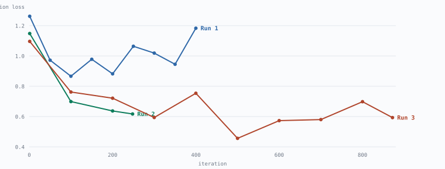

# The Verifier Is the Asset: Manufacturing Training Data for Domain-Specialised Code Models

## Abstract

Code models trained mostly on general-purpose corpora make a characteristic error on
narrow, fast-moving APIs: they emit well-structured code that calls functions which do not
exist. We measured this on a 14B open model and did not test any frontier system, so the
scope of the claim is that model class and those two domains. We show that in
domains where correctness is *decidable by execution*, training data can be manufactured
whose correctness is verified rather than assumed, and that the bottleneck in practice is
building the verifier, since generating candidate data is cheap. Our central technique adapts **mutation testing** [2,3] to
data synthesis: repair tasks are mined from real repositories by verifying that an original
file passes every gate, injecting a defect, and requiring the toolchain to *prove* the
mutant broken. The reference answer is the human author's own file, so no teacher model is
involved. Instantiated for Roblox Luau and Blender `bpy`, a LoRA adapter [1] on a 14B base
improves pass@1 from **27% to 48%** on 100 held-out tasks under a repository-grouped split
(McNemar exact [4], *p* = 0.0005). We show by category breakdown that the gain concentrates in mined Luau repair
tasks while other categories do not improve, and report eleven instrumentation failures, all of
which produced a plausible number instead of a visible error, as a result in their own
right.

## 1. Motivation

We scored `Qwen2.5-Coder-14B-Instruct` (8-bit) on held-out tasks through executable gates.
It passed 1 of 13. Every failure was an invented or misremembered API:

    blender:run   noise() takes at most 2 arguments (3 given)
    blender:run   create_cone: keyword "diameter1" is invalid
    blender:run   BMeshOpsModule: operator "extrude_region_mov..."
    luau:analyze  8 / 6 / 17 / 5 / 12 / 21 type/API errors across six tasks

`unparseable output: 0`. The model followed the output contract exactly and called APIs that
do not exist. No metric that does not execute the code can see this.

### 1.1 Why a small specialised model rather than a large general one

We did not test a frontier model, so this paper makes no claim that one would fail these
tasks. The argument for specialisation is economic and architectural rather than a claim
about capability ceilings. Thomson Reuters built a legal model on their own archive and
deploys it only where it has an advantage, routing the rest to general models; the same
shape applies here. For a narrow, high-volume task, a small model trained on verified
in-domain data can be competitive at a fraction of the cost per call.

The deployment target sharpens this. The intended use is a model driving Roblox Studio
through an editor plugin, invoked continuously during editing, where per-call latency and
cost determine whether the tool is usable. A 14B model resident on the developer's own
machine answers under conditions an API round trip does not.

## 2. Method

    ingest (licence-gated) → modernise (deterministic) → mine (mutate + kill) → verify
      → LoRA → evaluate THROUGH THE SAME GATES

**Gates.** *Luau*: static scan; `luau-lsp` type analysis against Roblox's published
definitions; `selene` lint; sandboxed `lune` execution. *Blender*: headless execution with
geometric assertions covering manifoldness, triangle budget, UV presence, material count
and normal orientation. `pass@1` means the code ran and built what was asked.

### 2.1 Licence-gated ingestion

Allowlist-only SPDX. A repository declaring no licence is rejected: "public" is not
"licensed for training". Every accepted file records its licence, permalink and commit sha,
so a NOTICE file can be regenerated without re-crawling.

    36,668 files · 1,278 repositories · 47.7M tokens
    MIT 33,443 · Apache-2.0 2,464 · Luau-Data-Sharing 1,591 · CC-BY-4.0 1,262 · other 761

No proxies or rate-limit circumvention were used. Curated ecosystem registries proved far
better than generic breadth: the Wally package index (Roblox's package manager) accepted
267 of 421 repositories, and its files cleared the reference gates at roughly twice the
rate of repositories found by star-filtered code search (35% against 85% reference
rejection).

### 2.2 Deterministic modernisation

Where a deterministic rewrite can guarantee a property, we apply it during preprocessing and leave the model to learn only what rules cannot express. Rewrites apply to
code spans only (a span-aware scanner distinguishes code from strings and comments); FLAG
and REJECT rules scan whole files, an asymmetry chosen because a false-positive reject
costs one file while a false-positive rewrite silently corrupts a sample.

Measured on Roblox's own published fine-tuning corpus [5] (first 1,914 rows): **620 rewrites
applied, 281 rows rejected as pre-2021, and 99.6% carried no `--!strict` header.**
Fine-tuning on that corpus as distributed teaches 2019 Luau.

### 2.3 Mutation-based task mining

    corpus file → verify ORIGINAL through every gate  → must PASS
                → inject defect
                → verify MUTANT through every gate    → must FAIL

Both checks do work. The first establishes that the reference answer
type-checks, lints clean and runs. The second is mutation
testing's *kill criterion*: a mutant the toolchain cannot distinguish from the original
would teach an edit nobody can demonstrate was needed. Such mutants are counted and
discarded.

Yield: **4,132 tasks from 26,385 candidate files (15.7%)**, at zero teacher cost.

<picture>
  <source media="(prefers-color-scheme: dark)" srcset="../figures/fig1-funnel-dark.svg">
  
</picture>

*Figure 1. Candidates are lost mostly because the original fails its own gates, which is a
quality filter rather than waste.*

| operator | n | contract | teaches |
|---|---:|---|---|
| `weaken_types` | 1,857 | kill-verified | strict typing |
| `implement_from_signature` | 1,407 | structural | module architecture |
| `deprecate` | 508 | kill-verified | current idiom |
| `hallucinate` | 360 | kill-verified | real vs invented APIs |

`implement_from_signature` removes function bodies, retaining types, signatures and doc
comments, and asks for the implementation. A stubbed module is incomplete rather than broken and
will often still type-check, so insisting on a kill would reject every architectural task. It is accepted
structurally instead: the reference passes every gate and N bodies were genuinely removed.
This is a weaker claim ("the task is well-posed and its answer is verified") and we report
it separately rather than conflating it with the kill-verified operators.

### 2.4 Teacher generation

Used only for task shapes mining cannot produce. Mining mutates files that already exist,
so it yields *zero* Blender samples. Over 163 unattended batches against a free-tier
endpoint: **485 verified / 184 rejected (72.5%)**, taking Blender from 49 to 369 samples.

## 3. Experimental protocol

**Repository-grouped splits.** Split membership is a stable hash of the *source repository*,
not the sample. Splitting by sample placed files from `Fusion` and `react-lua` in training
while other files from the same repositories sat in evaluation. When we checked, **all 7
evaluation repositories were also training repositories**. A model can learn a repository's
house style and appear to generalise. Verified after the fix: 0 repositories straddle the
split.

**Stable membership.** The build originally reshuffled train/eval on every rebuild, so a
baseline measured before a rebuild was not comparable with an adapter measured after.
Verified after the fix: growing the dataset tenfold moves 0 samples out of the eval set.

**Pinned evaluation.** Both scores in a comparison read the same pinned file, and the paired
test aborts outright if the task sets differ.

**Metrics.** We report `pass@1` alongside the mean number of gates a task cleared before
failing. On a small eval set pass@1 moves only in coarse steps: measured, an adapter scored
identically to its base at 1/13 while advancing one task from 2 gates to 4. Depth is a
progress signal, not a success criterion.

## 4. Results

<picture>
  <source media="(prefers-color-scheme: dark)" srcset="../figures/fig2-validation-dark.svg">
  
</picture>

*Figure 2. Run 1 exhausts its signal inside a single pass over 118 rows and degrades after.
Run 3 reaches 0.456. The checkpoint evaluated is the lowest-validation one, not the last.*

Base: `Qwen2.5-Coder-14B-Instruct-8bit`. LoRA rank 32 over attention and MLP projections,
32 layers, 872 iterations, `batch_size` 1, `max_seq_length` 4096. Training data 2,263 rows;
evaluation 100 held-out tasks under the grouped split.

| | pass@1 | mean gates cleared |
|---|---:|---:|
| baseline | 27.0% | 2.93 |
| adapter | **48.0%** | 3.40 |
| delta | **+21.0** | **+0.47** |

Paired: 20 both pass, **28 adapter-only**, 7 baseline-only, 45 neither.
**McNemar exact two-sided *p* = 0.0005** on 35 discordant pairs.

Measured at a 6,000-token generation budget. An earlier run at 3,000 tokens gave
32 / 48 with *p* = 0.009; the baseline moved between the two runs purely through
sampling variance, which is issue #10 in section 6.

### 4.1 The gain is one category

| category | n | base | adapter | Δ |
|---|---:|---:|---:|---:|
| `weaken_types` | 47 | 15 | 32 | **+17** |
| `deprecate` | 18 | 5 | 11 | **+6** |
| `teacher:blender` | 17 | 2 | 1 | −1 |
| `implement_from_signature` | 9 | 3 | 3 | 0 |
| `hallucinate` | 7 | 2 | 1 | −1 |
| `teacher:roblox` | 2 | 0 | 0 | 0 |

<picture>
  <source media="(prefers-color-scheme: dark)" srcset="../figures/fig3-categories-dark.svg">
  
</picture>

*Figure 3. Gains sit in the two mined Luau repair categories.*

Gains sit in the two mined Luau repair categories. Blender tasks, API-hallucination tasks
and module-writing tasks show no improvement.

These per-category figures are not stable across runs. The same adapter and the same 100
tasks, re-scored at a larger generation budget, moved `deprecate` from +0 to +6 and
`weaken_types` from +16 to +17. With roughly ±5 tasks of sampling noise per condition, a
category of n = 18 cannot support a delta of ±6. The paired total is robust; the
per-category split is indicative only.

### 4.2 Where the failures moved

`pass@1` rose 21 points while mean gate depth rose 0.47, and the distribution of gate depth
explains why those two move at such different rates. The shift is bimodal rather than
uniform: tasks that improve tend to go all the way to passing, while a smaller cluster
appears at depth 0, where the output could not be parsed into files and no gate ran at all.

| gates cleared | 0 | 1 | 2 | 3 | 4 | 5 |
|---|---:|---:|---:|---:|---:|---:|
| baseline | 0 | 2 | 56 | 14 | 3 | 25 |
| adapter | 9 | 1 | 28 | 12 | 3 | 47 |

The adapter adds 22 tasks at full depth and drains depth 2, but introduces 9 tasks at depth
0 where the baseline had none. Raising the generation budget from 3,000 to 6,000 tokens cut
unparseable adapter outputs from 14 to 9; the remainder are a real regression in output
format, not a truncation artefact.

### 4.3 Negative results

**Larger batches are slower here.** `batch_size` 2 achieved 52.7 tok/s against 85 tok/s at
batch 1, and peaked at 31.7 GB against 26.2 GB. Batches pad every sequence to the longest
member; with median 1,057 tokens against a 4,096 maximum, padding waste exceeds the
parallelism gain.

**Validation loss is a weak proxy for gate performance.** In an earlier run the
lowest-validation checkpoint scored worst of the three on gate depth at 2.46, below
both the final overfit checkpoint (2.69) and the untuned base (2.54).

**Checkpoint selection is not optional.** mlx-lm writes the *final* checkpoint to
`adapters.safetensors`. In this run validation bottomed at iteration 500 (0.456) and the
final checkpoint was **30% worse** (0.593); evaluating the default would have materially
understated the result.

## 5. Threats to validity

- **Self-referential evaluation.** Held-out tasks are produced by the same mutation
  operators the model trains on. An external benchmark of human-reported defects would be
  substantially stronger. *Unaddressed.*
- **Category imbalance.** `weaken_types` is 47% of the eval set; `hallucinate` is 7 tasks
  and `teacher:roblox` is 2. Per-category claims outside the dominant category are
  underpowered, and section 4.1 should be read as descriptive rather than inferential.
- **Single seed, no ablations.** No variance estimate. Three ablations would be informative and
  none has been run: verified against unverified data, mined against teacher-generated, and
  with against without the modernisation pass.
- **Seven tasks regressed.** The adapter is not uniformly better.
- **Teacher licensing.** Outputs from cloaked and free-tier endpoints were used as training
  data; terms were not verifiable in every case. Material if weights are published.

## 6. Instrumentation failures

Eleven measurement bugs were found, **each producing a plausible number rather than an
error**. We report them because the literature systematically omits them and because two of
them invalidated results we had already believed.

| # | bug | consequence |
|---|---|---|
| 1 | eval reloaded the 25 GB model once per task | 13× wasted I/O |
| 2 | eval system prompt differed from the training prompt | the delta measured the prompt |
| 3 | memory guard gated on `Pages free` | refused a model that fit with 15 GB to spare |
| 4 | student parser did not strip markdown fences | valid Python scored `SyntaxError`; **0% → 7.7%** |
| 5 | train/eval split reshuffled on every rebuild | base and adapter scored on different sets |
| 6 | split by sample rather than repository | all 7 eval repos also in train; **invalidated the then-current result** |
| 7 | `anonymous − stored_in_compressor` went negative | reported 29.8 GB usable at 84% swap |
| 8 | sequence filter used a character approximation | 0.9% of rows truncated mid-file |
| 9 | generation budget sized for the base model | unparseable adapter outputs 14 → 9 once raised |
| 10 | generation sampled with no fixed seed | the same baseline scored 32 and 27; **±5 tasks of noise** |
| 11 | unparseable outputs saved truncated at 4,000 characters | a diagnosis of *why* they failed measured the save cap |

We scrutinised the model's output from the first week and the code doing the checking
barely at all. Bug 4 alone moved the headline by 7.7 points, and bug 6 invalidated the only
positive result obtained up to that point. Several of these survived for weeks because they
failed quietly: the pipeline kept running and the numbers stayed within a plausible range.
We would now treat measurement code in a project of this shape as requiring the same review
as the samples it judges.

## 7. Reproducibility

`results/experiments.jsonl` records every run with its configuration, dataset SHA-256 and row
count, metrics, and the per-task pass/fail vector required for paired testing. Figures are
generated from those artefacts by `code/make_figures.py`; no number in this paper is typed by
hand.

## 8. Future work

The immediate experiment is a **category-balanced evaluation**: cap `weaken_types` so all
task types are comparably represented, and re-measure. That distinguishes a model which has
learned one transformation well from one which has generalised. Beyond that: multiple seeds,
the three ablations above, and an external benchmark not produced by our own operators.

## 9. References

[1] Hu, E. J., Shen, Y., Wallis, P., Allen-Zhu, Z., Li, Y., Wang, S., Wang, L., Chen, W.
*LoRA: Low-Rank Adaptation of Large Language Models.* arXiv:2106.09685, 2021.

[2] DeMillo, R. A., Lipton, R. J., Sayward, F. G. *Hints on Test Data Selection: Help for
the Practicing Programmer.* IEEE Computer 11(4), 1978.

[3] Jia, Y., Harman, M. *An Analysis and Survey of the Development of Mutation Testing.*
IEEE Transactions on Software Engineering 37(5), 2011.

[4] McNemar, Q. *Note on the sampling error of the difference between correlated
proportions or percentages.* Psychometrika 12(2), 1947.

[5] Roblox. *luau_corpus.* HuggingFace Datasets, `Roblox/luau_corpus`.
